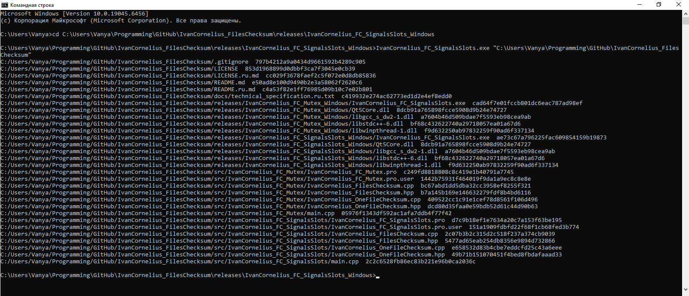

# IvanCornelius FilesChecksum

Консольное приложение на C++, созданное с использованием фреймворка Qt, которое вычисляет MD5 контрольные суммы для всех файлов в указанном каталоге и его подкаталогах. Приложение предназначено для работы в операционных системах Windows и Linux.

## Возможности

*   **Многопоточная обработка:** Вычисляет контрольные суммы для нескольких файлов одновременно с использованием отдельных потоков.
*   **Две реализации синхронизации:** Предоставляет две различные версии приложения, демонстрирующие разные техники синхронизации потоков:
    *   **На основе мьютексов (Mutex):** Использует `QMutex` для защиты общих данных.
    *   **На основе сигналов/слотов (Signals/Slots):** Использует механизм сигналов и слотов Qt для потокобезопасного взаимодействия.
*   **Рекурсивный обход каталогов:** Сканирует все файлы в указанном стартовом каталоге и его подкаталогах.
*   **Алфавитный вывод:** Выводит полный путь к файлу и соответствующую ему MD5 контрольную сумму в алфавитном порядке.
*   **Обработка ошибок:** Корректно обрабатывает файлы и каталоги, доступ к которым невозможен из-за ограничений прав.
*   **Кросс-платформенность:** Совместимо с Windows и Linux.

## Пример работы

## Использование

Запустите приложение из командной строки, указав путь к стартовому каталогу в качестве аргумента.

./IvanCornelius_FilesChecksum /путь/к/вашему/каталогу

**Пример вывода:**
/путь/к/вашему/каталогу/файл1.txt  d41d8cd98f00b204e9800998ecf8427e
/путь/к/вашему/каталогу/подкаталог/файл2.pdf  a1b2c3d4e5f678901234567890abcdef
...

## Основные детали реализации

*   **Версия с мьютексом:** Исходный код доступен в ([src/IvanCornelius_FC_Mutex](src/IvanCornelius_FC_Mutex)). Рабочие потоки наследуются от `QThread`. Они напрямую обращаются к общему `QMap` с результатами, защищенному `QMutex`. Главный поток управляет пулом рабочих потоков.
*   **Версия с сигналами/слотами:** Исходный код доступен в ([src/IvanCornelius_FC_SignalsSlots](src/IvanCornelius_FC_SignalsSlots)). Рабочие объекты наследуются от `QObject` и живут в отдельных потоках (`QThread`). Взаимодействие (отправка результатов, ошибок, сигналов завершения) осуществляется исключительно через сигналы и слоты Qt, которые являются потокобезопасными при соединении с типом `Qt::QueuedConnection` (используется по умолчанию для межпоточных соединений).

## Готовые исполняемые файлы

Готовые исполняемые файлы для Windows доступны для обеих версий:
*   Версия с мьютексом: ([releases/IvanCornelius_FC_Mutex_Windows](releases/IvanCornelius_FC_Mutex_Windows))
*   Версия с сигналами/слотами: ([releases/IvanCornelius_FC_SignalsSlots_Windows](releases/IvanCornelius_FC_SignalsSlots_Windows))

## Техническое задание

С оригинальным техническим заданием можно ознакомиться в ([docs/technical_specification.ru.txt](docs/technical_specification.ru.txt)).

## Лицензия

Этот проект распространяется под лицензией MIT. С лицензией можно ознакомиться ([LICENSE.md](LICENSE.md)).